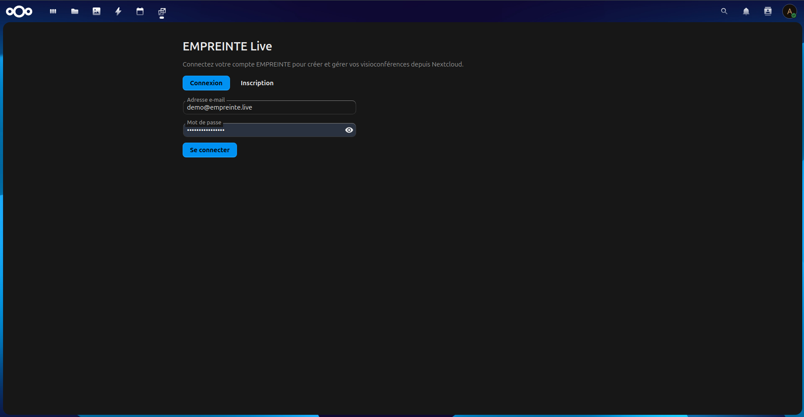
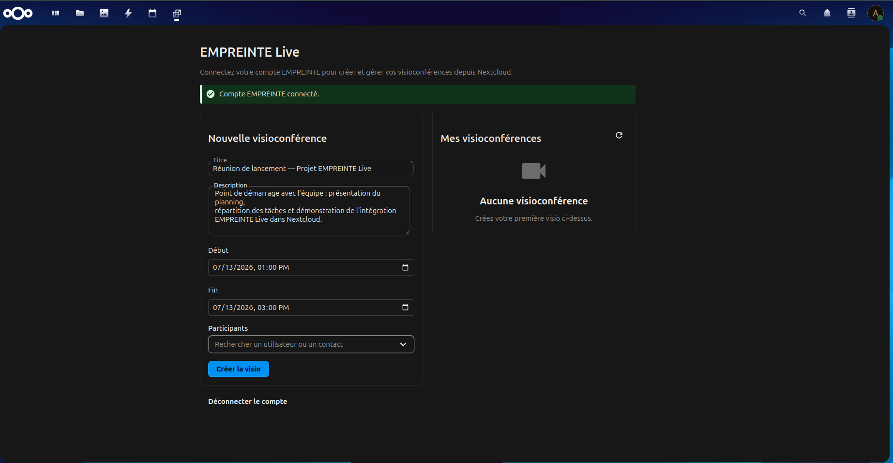
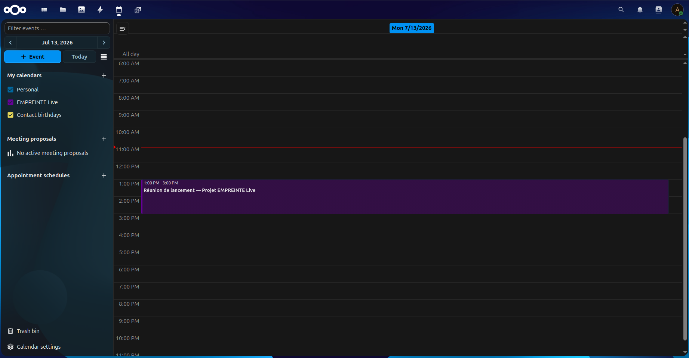

# EMPREINTE Live

> Nextcloud Calendar integration for EMPREINTE Live video meetings.

**EMPREINTE Live for Nextcloud** is an open-source application that brings **EMPREINTE Live** video meetings into your Nextcloud workspace, alongside the official **Nextcloud Calendar** application.

It allows users to schedule, manage, and join video meetings directly from their Nextcloud workspace while keeping the official Calendar application unchanged.

> This application extends Nextcloud Calendar without forking or modifying it.

- **App ID:** `empreintelive` · **Namespace:** `OCA\EmpreinteLive`

---

## Features

- 🔐 Secure connection to an EMPREINTE Live account using OAuth 2.0, with an explicit consent screen
- 🎥 Create, list, join, and delete video meetings from the dedicated **EMPREINTE Live** app (its icon in the Nextcloud top app menu)
- 📅 Integration with the official Nextcloud Calendar application
- 🔄 Automatic synchronization when the linked calendar event is moved to trash, permanently deleted, or edited
- ♻️ Reconciliation of the "EMPREINTE Live" calendar on login (back-fills missing meetings, hides meetings that belong to another account — never deletes anything on the EMPREINTE side)
- 👥 Participant autocomplete (Nextcloud users and contacts)
- 🔗 Organizer-only meeting link, reserved for the creator
- 🛡️ Server-side token management (no sensitive tokens exposed to the browser)
- 🚀 Native Nextcloud integration using official OCP APIs and events

---

## Requirements

- Nextcloud **32 to 34**
- PHP **8.1 to 8.5**
- Official **Nextcloud Calendar** application installed and enabled
- An active **EMPREINTE Live** account

---

## Installation

### From Nextcloud App Store


1. Open **Apps** in Nextcloud
2. Search for **EMPREINTE Live**
3. Install and enable the application

---

### Manual installation

1. Download the latest release.

2. Extract the application into:

```text
custom_apps/
```

3. Enable the application:

```bash
php occ app:enable empreintelive
```

4. Configure your EMPREINTE Live connection (see below).

---

## Configuration

After installation:

1. Open the **EMPREINTE Live** app from the top app menu (its icon next to the other apps).
2. Connect your EMPREINTE Live account.
3. Authorize access through the OAuth consent screen.

Sensitive credentials and tokens are handled server-side and are never exposed to the browser.

---

## Development

For developers who want to contribute or run the application locally:

See:

📖 [Development documentation](DOCUMENTATION.md)

The documentation includes:

- Development environment setup
- Architecture overview
- Backend workflow
- Calendar integration details
- OAuth configuration
- Testing instructions

---

## Architecture overview

```text
┌──────────────────────┐
│ Nextcloud Calendar   │
└──────────┬───────────┘
           │
           ▼
┌──────────────────────┐
│ EMPREINTE Live       │
│ Nextcloud App        │
└──────────┬───────────┘
           │
           ▼
┌──────────────────────┐
│ EMPREINTE Live       │
│ Video Server         │
└──────────────────────┘
```

---

## Testing

### Frontend tests (Vitest)

```bash
npm run test:unit
```

### Backend tests (PHPUnit)

```bash
phpunit --configuration phpunit.xml
```

More details are available in the development documentation.

---

## Screenshots

### Account connection



### EMPREINTE Live app page



### Calendar integration



---

## Contributing

Contributions are welcome.

Before submitting a pull request:

1. Read the contribution guidelines.
2. Create a feature branch.
3. Add tests when possible.
4. Submit a pull request with a clear description.

---

## Security

If you discover a security issue, please report it privately.

Do not open a public issue containing sensitive security information.

---

## License

Copyright (C) 2026 EMPREINTE

This project is licensed under the **GNU Affero General Public License v3.0 or later (AGPL-3.0-or-later)**.
See the [LICENSE](LICENSE) file for the full license text.

---

## Links

- Nextcloud: https://nextcloud.com
- EMPREINTE Live: [go.empreinte.live](https://go.empreinte.live)
- Documentation: [DOCUMENTATION.md](DOCUMENTATION.md)
